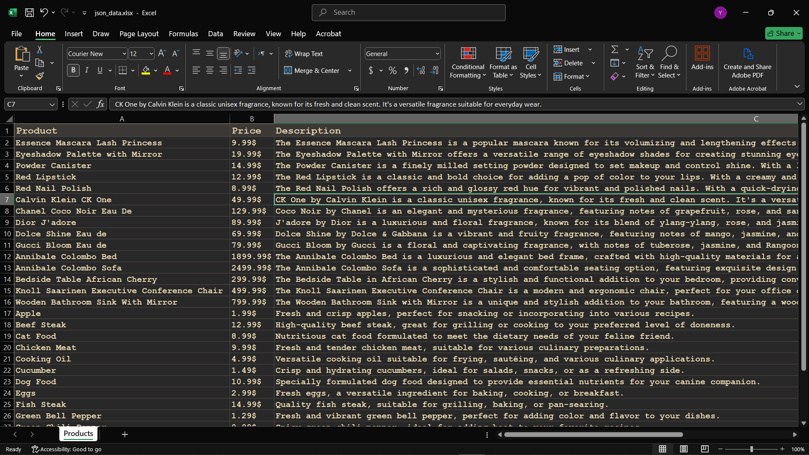

# JSON Parsing & Excel Export Practice

### Just a simple project to practice and upgrade my skills in handling large JSON files and parsing nested data.

* **The Idea:** Got a JSON file from a popular website to paractice fetcheing and decomposing data.

* **Tech Stack:** Python, Requests, Pandas, Openpyxl.

* **Result:** Extracted product details (Titles, Prices, Brands, Description, Discount, Ratings, Stock), handled missing keys (KeyError), and exported everything into a clean Excel sheet.

## Screenshot

