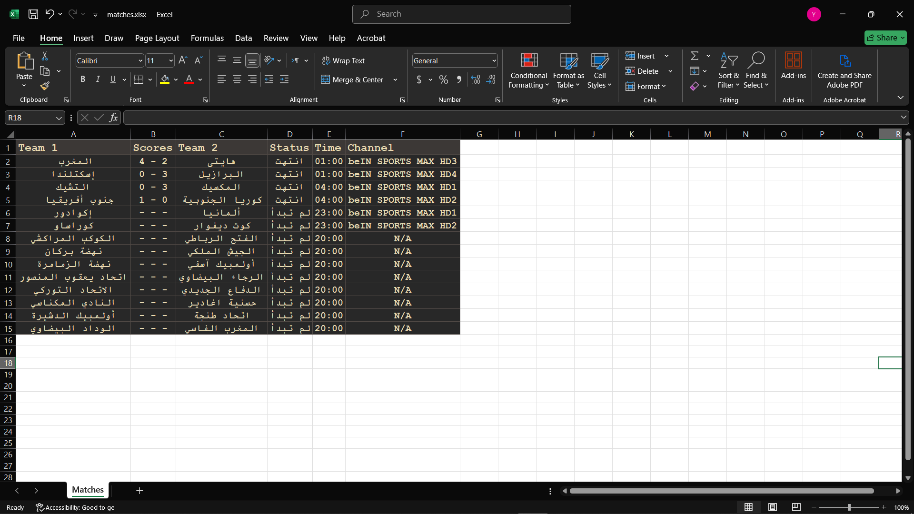
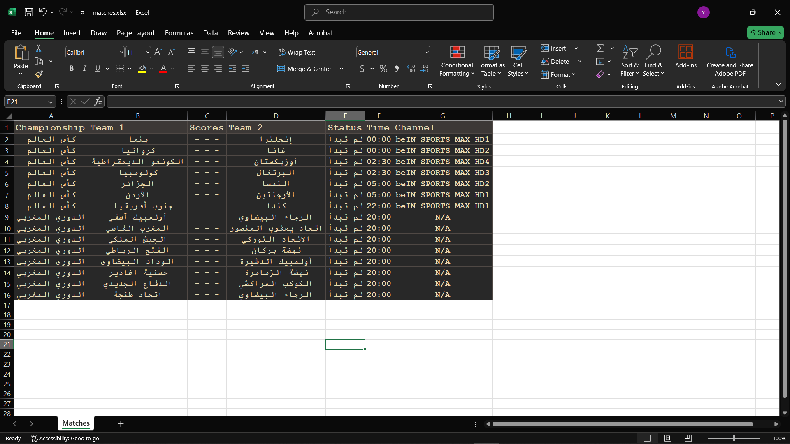

# Yalla Kora Project

## Description

- It gets all matches will play in any day.

## Features

### The project gets : 

- team names

- scores if match is played

- the match time

- match status

- channels displayed the match

- Colors and style by openpyxl

## Technologies used

- Python

- Playwright To solve JavaScript problem

- pandas

- openpyxl

## How to Run

- Write in VS terminal :

pip(or pip3) install -r requirements.txt

#### or download modules:

- pip install pandas

- pip install playwright

- playwright install (to install playwright browsers)

- pip install openpyxl

## Screenshot

## Screenshot's upgrade

# Championship data added