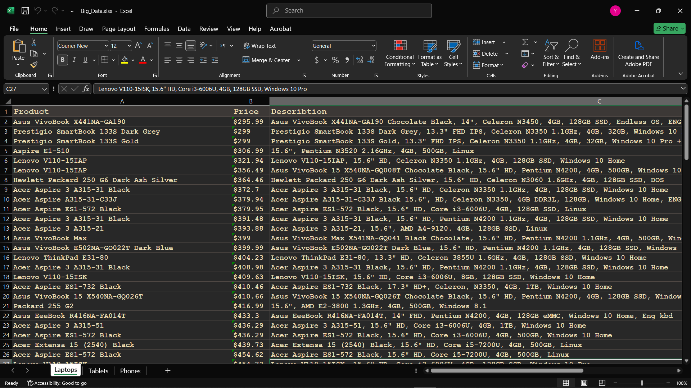
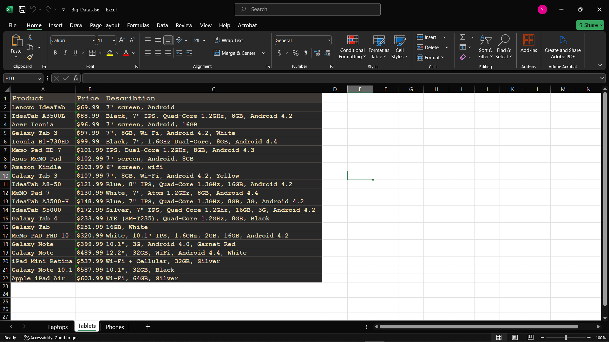
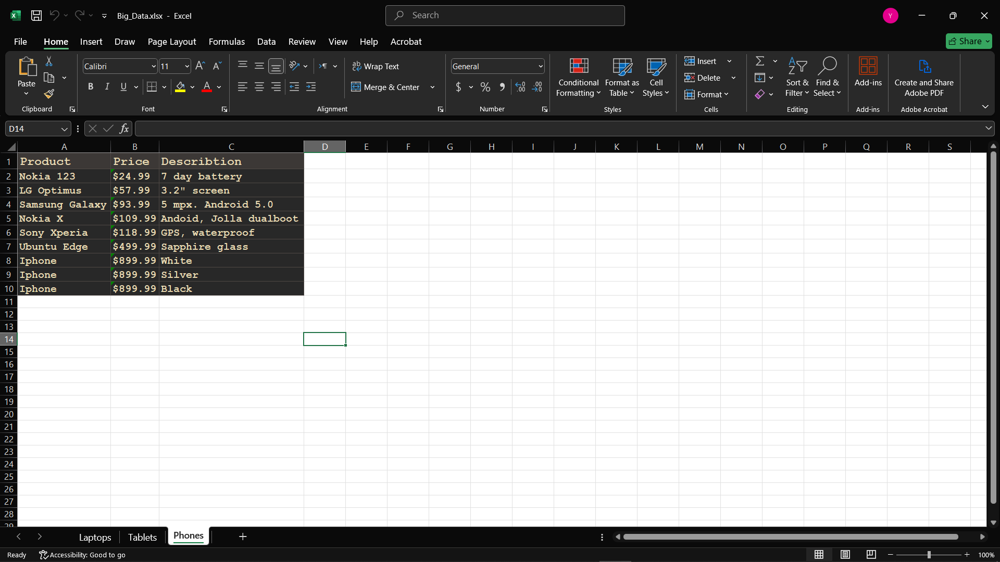

# Webscraper.io Project (E-commerce side)

## Description

- It gets all information about products.

## Features

### The project gets : 

- product name

- product price

- product description

- 3 sheets (laptops, tablets, phones)

## Technologies used

- Python

- Playwright To solve JavaScript problem

- openpyxl

## How to Run

- Write in VS terminal :

pip(or pip3) install -r requirements.txt

#### or download modules:

- pip install playwright

- playwright install (to install playwright browsers)

- pip install openpyxl

## Screenshot sheet 1

## Screenshot sheet 2

## Screenshot sheet 3

